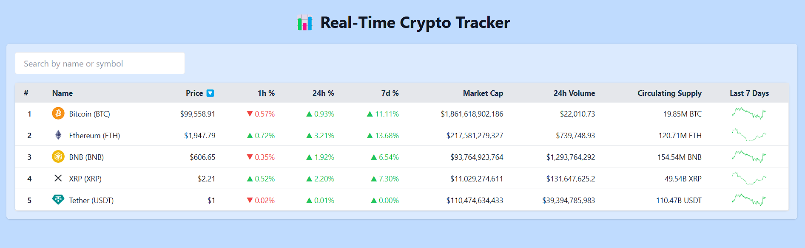

# 📊 Real-Time Crypto Price Tracker

A responsive React + Redux Toolkit application that tracks real-time cryptocurrency prices with simulated live updates. It mimics platforms like CoinMarketCap and includes sorting, filtering, and a clean UI with chart previews.



---

## 🎯 Objective

Build a real-time crypto price tracker that:
- Displays key metrics of top cryptocurrencies.
- Simulates WebSocket price updates.
- Manages all data using Redux Toolkit.
- Provides filtering and sorting options.
- Is fully responsive and user-friendly.

---

## 🧪 Features

- 📈 **Live Updates**: Simulated using `setInterval` to mimic WebSocket behavior.
- 🗃️ **Redux Toolkit**: Centralized state management for all asset data.
- 🔍 **Filtering**: Search by asset name or symbol.
- 🔃 **Sorting**: Sort by price, % changes, market cap, etc.
- 💡 **Color Coding**: Positive/negative % changes in green/red.
- 🖼️ **7-Day Chart**: Static SVG chart preview.
- 📱 **Responsive Design**: Tailwind CSS ensures mobile-friendly layout.
- 🎁 **Bonus Support** (ready to implement):
  - Binance WebSocket integration
  - localStorage
  - TypeScript
  - Unit tests for reducers/selectors

---

## 🚀 Live Demo

🎥 **[Watch the Demo Video](https://your-demo-link.com)**  
🧪 *Walkthrough includes: UI, state updates, sorting/filtering logic, and component breakdown.*

---

## 🛠 Tech Stack

| Tech             | Usage                                  |
|------------------|-----------------------------------------|
| React            | Frontend framework                     |
| Redux Toolkit    | State management (`createSlice`, etc.) |
| Tailwind CSS     | Styling and layout                     |
| JavaScript       | Core logic                             |
| Mock WebSocket   | Simulated real-time data               |

---

## 🧠 App Architecture


---

## 📁 How to Run Locally
 ```bash
npm run dev
```

### 1. Clone the Repository

```bash
git clone https://github.com/your-username/crypto-price-tracker.git
cd crypto-price-tracker

### ✅ Summary of What You’ve Implemented So Far

- React + Redux architecture
- Simulated WebSocket
- Dynamic table with static charts
- Sorting & filtering
- Responsive UI with Tailwind
- Clean Redux slices (crypto + UI)
