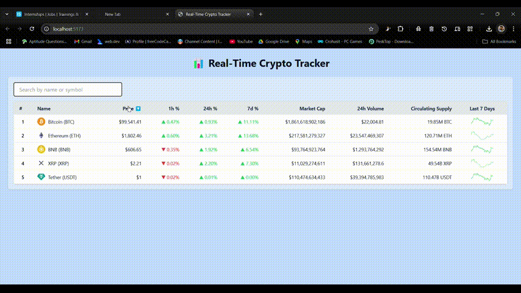

# 📊 Real-Time Crypto Price Tracker

A responsive web app built with **React** and **Redux Toolkit** that displays real-time cryptocurrency prices and charts. Inspired by platforms like CoinMarketCap, it supports live updates, filtering, and sorting.


## 🎯 Objective

Build a responsive app that:
- Displays crypto asset data in a table.
- Simulates real-time price updates (with an option for real WebSocket).
- Uses Redux Toolkit for state management.
- Offers interactive features like filtering and sorting.

---

## 🚀 Live Demo

👉 <p align="center">
  
</p>


---

## 🧪 Features

- 📈 Real-time simulated price updates using a mock WebSocket class.
- 🔍 Filter by asset name or symbol.
- 🔃 Sort by price, % change, etc.
- 🧠 Centralized state management using Redux Toolkit.
- 📱 Responsive UI with Tailwind CSS.
- ✅ Clean component-based structure.
- 🌟 Bonus:
  - Real WebSocket (Binance) ready support.
  - 7-day trend chart (static SVG).
  - Expandable for features like localStorage, unit tests, and TypeScript.

---

## 🛠 Tech Stack

| Tech             | Usage                                  |
|------------------|-----------------------------------------|
| React            | Frontend framework                     |
| Redux Toolkit    | State management (`createSlice`, etc.) |
| Tailwind CSS     | Styling and layout                     |
| JavaScript       | Core logic                             |
| Mock WebSocket   | Simulated real-time data               |


## 🧠 Architecture


---

## 🛠 Tech Stack

- ⚛️ React (with Hooks)
- 📦 Redux Toolkit (`createSlice`, `configureStore`)
- 💨 Tailwind CSS (for UI styling)
- 🔁 Mock WebSocket (`setInterval`)
- 📈 Static SVG line charts

---

## 🧰 Setup Instructions
```
npm run dev
```

###  Clone the repo

```bash
git clone https://github.com/your-username/crypto-price-tracker.git
cd crypto-price-tracker
```

### ✅ Summary of What You’ve Implemented So Far

- React + Redux architecture
- Simulated WebSocket
- Dynamic table with static charts
- Sorting & filtering
- Responsive UI with Tailwind
- Clean Redux slices (crypto + UI)
